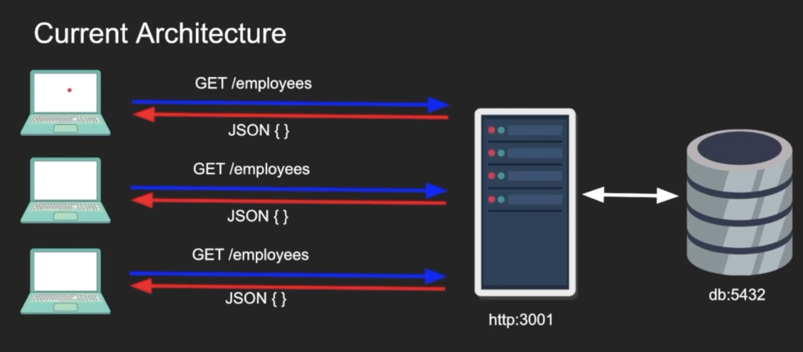
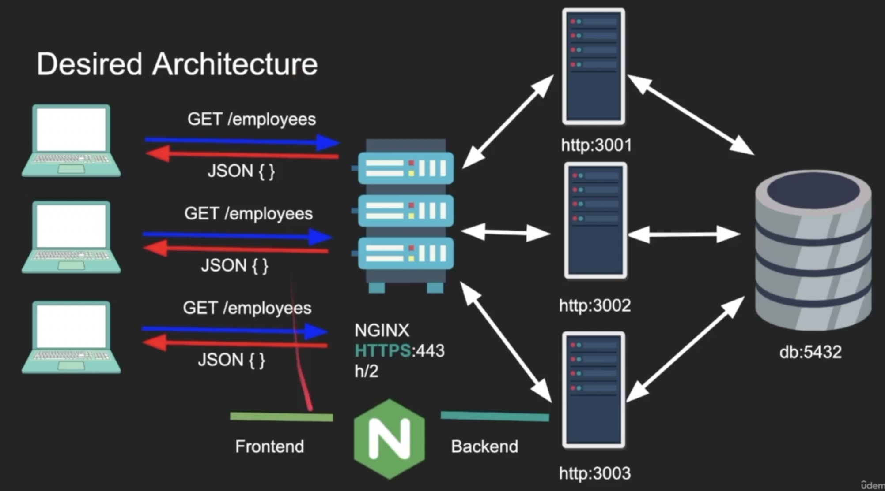

# NGINX Fundamentals

## What is NGINX

- Web Server - serves web content.
- Reverse Proxy - It can be made facing the internet, it will take the request and move them across the backend for Load Balancing, Backend Routing, Caching, API Gateway (rate limiting).

## NGINX Use Cases

Current Vs Desired Architecture:

## Layer 4 & Layer 7 Load Balancing in NGINX

- Layer 4/7 refers to OSI model.
- In Layer 4, we only see the TCP/IP stack and nothing about the app, we have access to:
  - Source IP, Source Port
  - Destination IP, Destination Port
  - Simple packet inspection (SYN/TLS hello)
- In Layer 7, we see the application, HTTP/gRPC, etc
  - We have access to more context
  - I know where client is going and which page they are visiting
  - Require decryption
- NGINX can operate in Layer 7 (eg http) or Layer 4 (tcp)
- Layer 4 proxing is useful when NGINX does not need to understand the protocol (MYSQL db protocol)
- Layer 7 proxing is useful when NGINX want to share backend connections and cache results
- Using stream context it becomes a Layer 4 proxy
- Using http context it becomes a Layer 7 proxy

## TLS Termination Vs TLS Passthrough

- TLS stands for Transport Layer Security
- It is a defacto way to establish end-to-end encryption between one another
- Symmetric encryption (very fast) is used for communication (client/server has the same key). Asymmetric encryption (very slow) is used initially to exchange the symmetric key (diffie hellman)
- Server (sometimes even the client) need to authenticate themselves by supplying a certificate signed by certificate authority

### TLS Termination

- NGINX has TLS (eg https) backend is not (http)
- NGINX terminates the TLS and decrypts and send unencrypted
- NGINX is TLS and backend is also TLS (https)
- NGINX terminates the TLS, decrypts, optionally rewrite and then re-encrypt the content to the backend
- NGINX can look at the L7 data, re-write headers, cache but needs to share the backend certificate or atleast has its own

### TLS Passthrough

- Backend is TLS
- NGINX proxies/streams the packets directly to the backend
- The TLS handshake is forwarded all the way to the backend just like a tunnel
- No caching, L4 check only, but more secure, NGINX does not need the backend certificate
