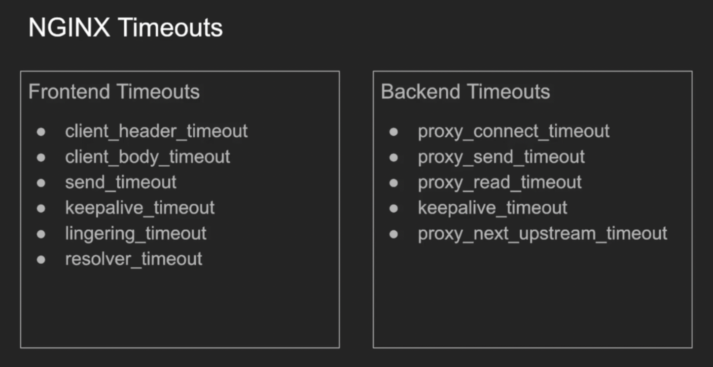
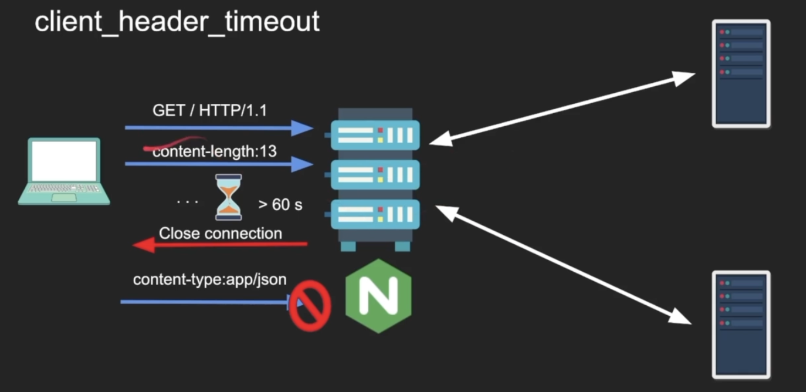
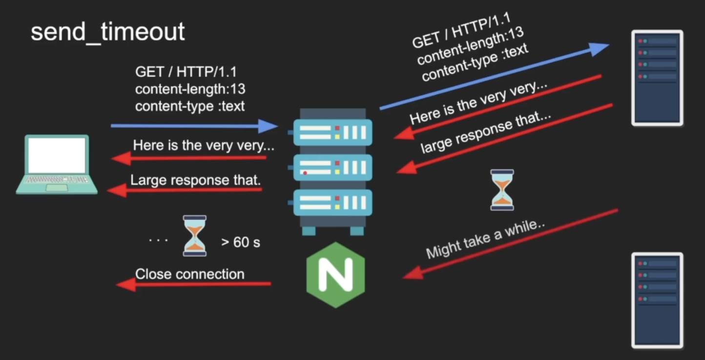
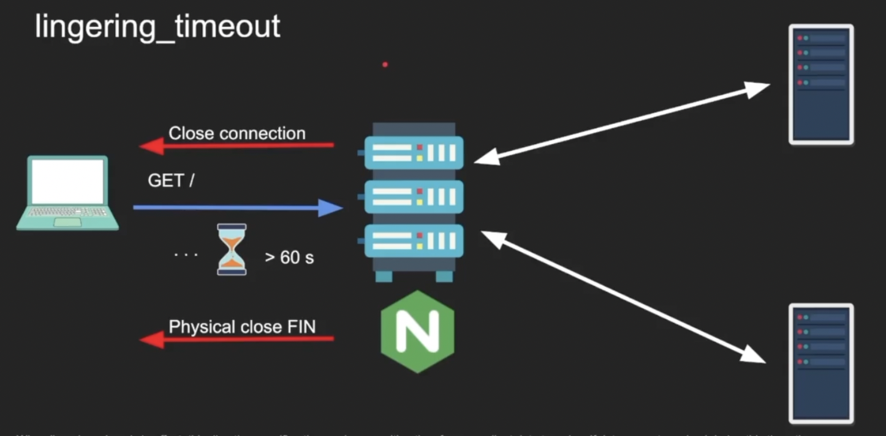
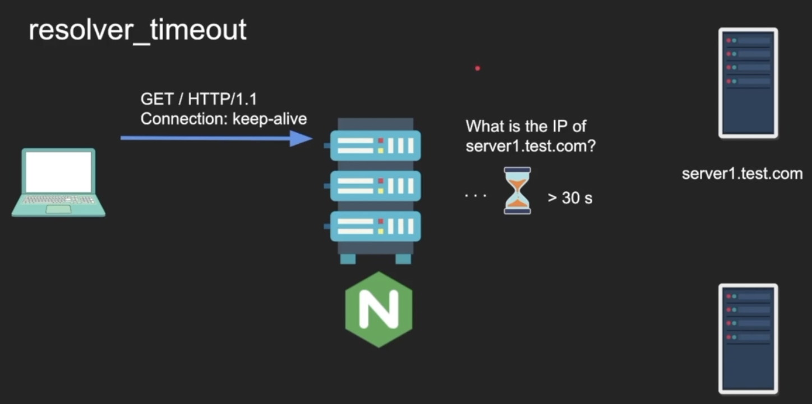
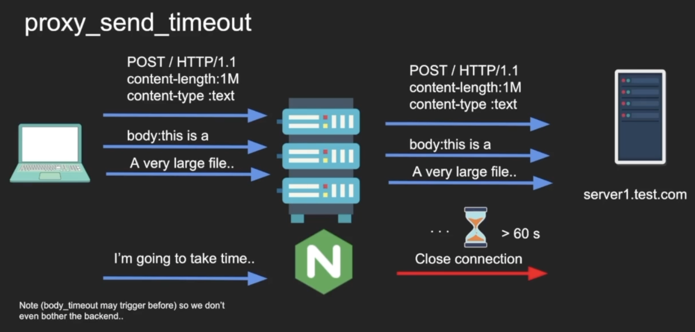

# NGINX Timeouts

Any proxy timeouts are very critical to control the security of the proxy, reverse proxy, load balancer.

 

## client_header_timeout

Defines the timeout for reading a client request header. If the client does not transmit the entire header within this time, the request is terminated with 408. Default is 60s.

Slowloris Attack: https://www.cloudflare.com/learning/ddos/ddos-attack-tools/slowloris/

## client_body_timeout

Defines the timeout for reading the client request body. The timeout is set only for a period of two successive read operations, not for the transmission of the whole request body. If the client does not transmit anything within this time, the request is terminated with 408 error. Default is 60s.

## send_timeout

Sets a timeout for transmitting a response to the client. The timeout is set only between the two successive write operations, not for the transmission of whole response. If the client does not receive anything within this time, the connection is closed. Default is 60s.

## keepalive_timeout

The first parameter sets a timeout during which a keep-alive client connection will stay open on the server side. The zero value disables the keep-alive client connections. The optional second parameter sets a value in the "Keep-Alive: timeout:time" response header field. The two parameters may differ. Default is 75s.

## lingering_timeout

When lingering_close is in effect, this directive specifies the maximum waiting time for more client data to arrive. If the data are not received during this time, the connection is closed, otherwise the data is read and ignored, and NGINX starts waiting for more data again. The wait-read-ignore cycle is repeated, but no longer than specified by the lingering_timeout directive.

## resolver_timeout

Sets a timeout for name resolution. Default is 30s.

## proxy_connect_timeout

Defines a timeout for establishing a connection with a proxied server. It should be noted that this timeout cannot usually exceed 75s.

## proxy_send_timeout

Sets a timeout for transmitting a request to the proxied server. This timeout is set only between the two successive write operations, not for the transmission of whole request. If the proxied server does not receive anything within this time, the connection is closed.

## proxy_read_timeout

## proxy_next_upstream_timeout

## keepalive_timeout_backend
