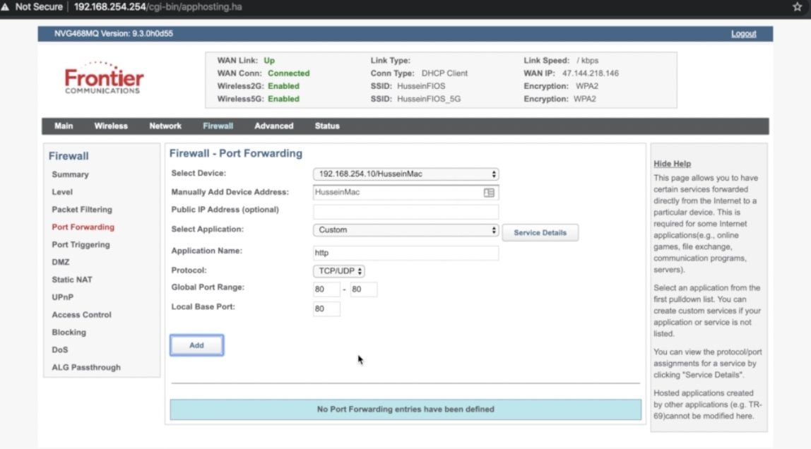

# Working with NGINX

## Installing NGINX

```shell
docker run --name nginx -d -p 8080:80 nginx
```

## NGINX as Web Server

```
docker exec -it nginx bash
apt-get update
apt-get install vim
vi etc/nginx/nginx.conf
```

Below lines of code is enough for nginx to serve a default web content

```
http {
    server {
        listen 8080;
    }
}

events {}
```

- If we want to serve our own content though, we just need to specify a directive "root" as

```
http {
    server {
        listen 8080;
        root /usr/src/website/;
    }
}

events {}
```

- If we want to serve different content based on urls, we need location directive as

```
http {
    server {
        listen 8080;
        root /usr/src/website/;

        location /images {
            root /usr/src/; # dont need to add /images
        }

        # we can forbid to serve any image with jpg extension
        location ~ .jpg$ {
            return 403;
        }
    }
}

events {}
```

- If we want to pass a request from one server to another we can do using proxy_pass directive as

```
http {
    server {
        listen 8080;
        root /usr/src/website/;
    }
    server {
        listen 8888;

        location / {
            proxy_pass http://localhost:8080/;
        }

        location /img {
            proxy_pass http://localhost:8080/images/;
        }
    }
}

events {}
```

## NGINX as Layer 7 Proxy

```
docker run -p 2222:9999 -e APPID=2222 -d nodeapp
docker run -p 3333:9999 -e APPID=3333 -d nodeapp
docker run -p 4444:9999 -e APPID=4444 -d nodeapp
```

load balancing

```
http {

    upstream allbackend {
        server 127.0.0.1: 2222;
        server 127.0.0.1: 3333;
        server 127.0.0.1: 4444;
    }

    server {
        listen 80;

        location / {
            proxy_pass http://allbackend/;
        }
    }
}

events {}
```

The above configuration is going to follow round-robin for serving the requests.

NOTE: "ip_hash" can be specified in upstream for sticky session. So, all traffic from a perticular client will always go to the same server.

```
http {

    upstream allbackend {
        server 127.0.0.1: 2222;
        server 127.0.0.1: 3333;
        server 127.0.0.1: 4444;
        server 127.0.0.1: 5555;
    }

    upstream app1backend {
        server 127.0.0.1: 2222;
        server 127.0.0.1: 3333;
    }

    upstream app2backend {
        server 127.0.0.1: 4444;
        server 127.0.0.1: 5555;
    }

    server {
        listen 80;

        location / {
            proxy_pass http://allbackend/;
        }
        location /app1 {
            proxy_pass http://app1backend/;
        }
        location /app2 {
            proxy_pass http://app2backend/;
        }
        location /admin {
            return 403;
        }
    }
}

events {}
```

## NGINX as Layer 4 Proxy

Here we need to use stream directive instead on http. The client will have connection to the proxy server and NGINX cannot resolve any url that app serves as it does not know anything about that.

```
stream {

    upstream allbackend {
        server 127.0.0.1: 2222;
        server 127.0.0.1: 3333;
        server 127.0.0.1: 4444;
        server 127.0.0.1: 5555;
    }

    server {
        listen 80;
        proxy_pass allbackend;
    }
}

events {}
```

## Enable HTTPS on NGINX

If we want to expose this NGINX to internet (public), we need to port forward from our router.

- Get your public IP address and try connecting to it - http://<PUBLIC_IP>. It is going to fail as it is the address of my router and router is not listening to port 80 or 443.
- Add port rules for 80 and 443 in router (Firewall - Port Forwarding)
  
- Now we should be able to access our NGINX on http://<PUBLIC_IP>
- Visit https://www.noip.com/. Here we can create a domain for free. Add a domain and add your public ip to that. Wait for some time and you should be able to access the NGINX by the domain name.
- Next step is to use LetsEncrypt (https://letsencrypt.org/) certificate authority to get a certificate for our website.

```
sudo certbot certonly --standalone
# enter your domain when prompted
```

```
http {

    upstream allbackend {
        server 127.0.0.1: 2222;
        server 127.0.0.1: 3333;
        server 127.0.0.1: 4444;
        server 127.0.0.1: 5555;
    }

    server {
        listen 80;

        listen 443 ssl;
        ssl_certificate /location-of-public-key
        ssl_certificate_key /location-of-private-key

        location / {
            proxy_pass http://allbackend/;
        }

    }
}

events {}
```

## Enablaing Fast & Secure TLS 1.3 on NGINX

TLS Checker: https://www.cdn77.com/tls-test

```
http {

    upstream allbackend {
        server 127.0.0.1: 2222;
        server 127.0.0.1: 3333;
        server 127.0.0.1: 4444;
        server 127.0.0.1: 5555;
    }

    server {
        listen 80;

        listen 443 ssl;
        ssl_certificate /location-of-public-key
        ssl_certificate_key /location-of-private-key
        ssl_protocols TLSv1.3;

        location / {
            proxy_pass http://allbackend/;
        }

    }
}

events {}
```

## Enable HTTP/2.2 on NGINX

```
http {

    upstream allbackend {
        server 127.0.0.1: 2222;
        server 127.0.0.1: 3333;
        server 127.0.0.1: 4444;
        server 127.0.0.1: 5555;
    }

    server {
        listen 80;

        listen 443 ssl http2;
        ssl_certificate /location-of-public-key
        ssl_certificate_key /location-of-private-key
        ssl_protocols TLSv1.3;

        location / {
            proxy_pass http://allbackend/;
        }

    }
}

events {}
```
